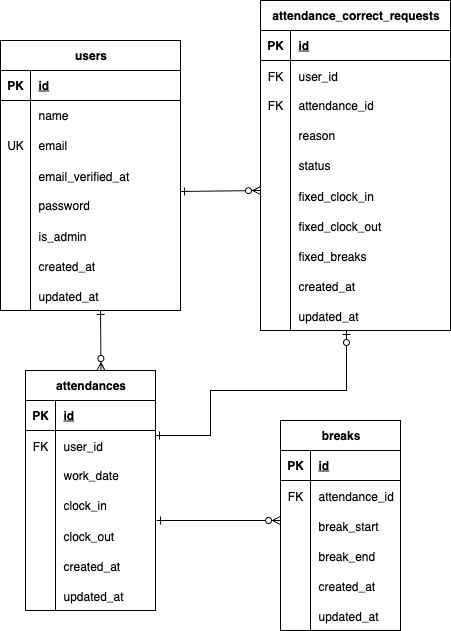

# mock-case2
coachtech勤怠管理システム

## 概要  
本プロジェクトは模擬案件2回目として作成された勤怠管理システムです。
- 一般ユーザー：勤怠打刻や修正申請
- 管理者：修正申請の承認、勤怠編集、CSV出力など
- Laravel Fortify によるユーザー認証
- MailHog を利用したメール認証確認環境

## インストール方法
### Dockerビルド・Laravel環境構築

1. DockerDesktopアプリを立ち上げる。
2. リポジトリをクローン  
   ```bash
   git clone git@github.com:Ami-3110/mock-case2.git
   cd mock-case2
   ```
3. Composerパッケージをインストール
    ```bash
   composer install
   ```
4. .env.example をコピーして .env にリネーム
    ```bash
    cp .env.example .env
    ```
5. .env のデータベース接続設定を修正
    ```bash
    DB_CONNECTION=mysql
    DB_HOST=mysql
    DB_PORT=3306
    DB_DATABASE=sail
    DB_USERNAME=sail
    DB_PASSWORD=password
    ```
6. Dockerコンテナをビルド＆起動
    ```bash
    ./vendor/bin/sail up -d --build
    ```
    ※ 既存のDockerコンテナやDBデータが残っている状態で再構築する場合は、
    以下を実行してから手順 6（コンテナ起動）に進んでください。
    ```bash
    ./vendor/bin/sail down -v
    ```
7. アプリケーションキーの作成
    ```bash
    ./vendor/bin/sail artisan key:generate
    ```
8. ストレージリンクの作成
    ```bash
    ./vendor/bin/sail artisan storage:link
    ```

9. マイグレーション・シーディングの実行
    ```bash
    ./vendor/bin/sail artisan migrate --seed
    ```

#### メール送信（開発環境用）
    開発用に MailHog を使用しています。
    メール送信処理を確認したい場合は、以下のURLからアクセスできます。

    MailHog: http://localhost:8025

    ※ .env で MAIL_HOST=mailhog が指定されている必要があります。

## URL
    Laravelアプリが正しく起動していると、以下のURLからアクセスできます。
    - トップページ（ログイン画面）: http://localhost/login
    - 新規登録画面: http://localhost/register

## 使用技術
Laravel 10.x
Laravel Fortify（認証機能）
PHP 8.2
MySQL 8.0
MailHog（開発用メール受信）
PHPUnit（テスト用フレームワーク）

## ER図

または別途提出のスプレッドシート(テーブル仕様書)参照

## ログイン情報

### 一般ユーザー（UserSeeder）
| 名前       | メールアドレス           | パスワード |
|------------|--------------------------|------------|
| Test User  | test@example.com          | password   |
| 西 伶奈    | reina.n@coachtech.com     | password   |
| 山田 太郎  | taro.y@coachtech.com      | password   |
| 増田 一世  | issei.m@coachtech.com     | password   |
| 山本 敬吉  | keikichi.y@coachtech.com  | password   |
| 秋田 朋美  | tomomi.a@coachtech.com    | password   |
| 中西 教夫  | norio.n@coachtech.com     | password   |

### 管理者（AdminUserSeeder）
| 名前           | メールアドレス        | パスワード   |
|----------------|-----------------------|--------------|
| 管理者ユーザー | admin@example.com     | password123  |

※ 全ユーザーは登録済み（メール認証完了済み）


## シーディング内容
本プロジェクトでは、動作確認や画面テスト用に以下のダミーデータを自動生成します。
（実行コマンド：php artisan migrate:fresh --seed）

### 作成データ一覧
**管理者アカウント（AdminUserSeeder）**  
- 管理画面用のアカウント 1 件

**一般ユーザー（UserSeeder）**  
- Test User（test@example.com） 他6件（UI掲載に準ずる）

**勤怠（AttendanceSeeder）**  
- 期間：2025/5/1〜2025/8/14（平日のみ）
- 出勤時間：8:00〜10:30 ランダム
- 休憩時間合計：30〜90分 ランダム
- 退勤時間：勤務8時間＋休憩時間
- 同一ユーザー・同一日付の勤怠がある場合は更新（重複防止）

**休憩（BreakSeeder）**  
- 各勤怠につき 1〜2件作成
- 勤務開始+1時間〜勤務終了-1時間の範囲で作成
- 他の休憩時間帯と重ならないようスロット管理
- 休憩時間：15〜60分 ランダム
- 再実行時は既存休憩を削除してから再作成（重複防止）

**勤怠修正申請（AttendanceCorrectRequestSeeder）**  
- 対象期間の勤怠（2025/5/1〜2025/8/14）からランダムに25件選択
- 修正理由：ランダム（例：「電車遅延のため」「寝坊しました」など）
- ステータス：前半20件を `pending`、残り5件を `approved`
- 出勤時刻：元の時刻から±30分ランダム
- 修正後の休憩：1〜2件、15〜60分ランダム（時間帯重複なし）
- 修正後の退勤：8時間勤務＋修正後休憩時間
- 再実行時は対象勤怠の既存申請を削除してから作成（重複防止）

## 機能一覧
### 一般ユーザー
- ログイン / ログアウト / 新規登録（メール認証必須）
- 勤怠打刻（出勤・退勤・休憩入・休憩戻）
- 月別勤怠一覧表示（本人のみ）
- 勤怠詳細表示
- 勤怠修正申請機能（各時刻の修正、備考）
- 修正申請一覧表示

### 管理者
- ログイン / ログアウト
- 日別勤怠一覧表示（全スタッフ）
- 勤怠詳細表示
- 勤怠修正申請機能（各時刻の修正、備考）
- スタッフ一覧表示
- スタッフ別月別勤怠一覧表示（CSV出力を含む）
- 修正申請一覧表示
- 修正申請承認機能
